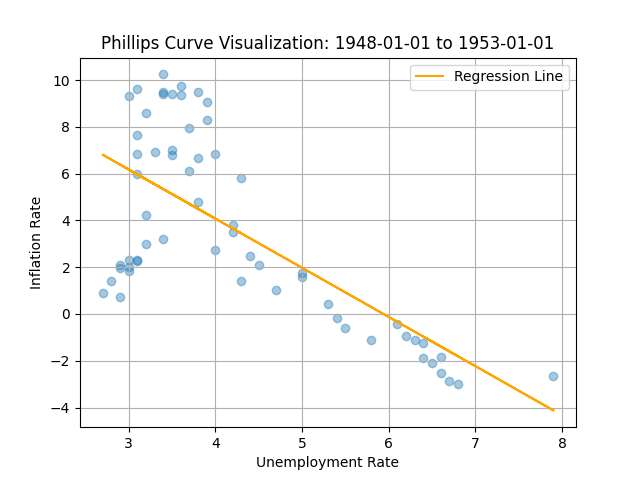
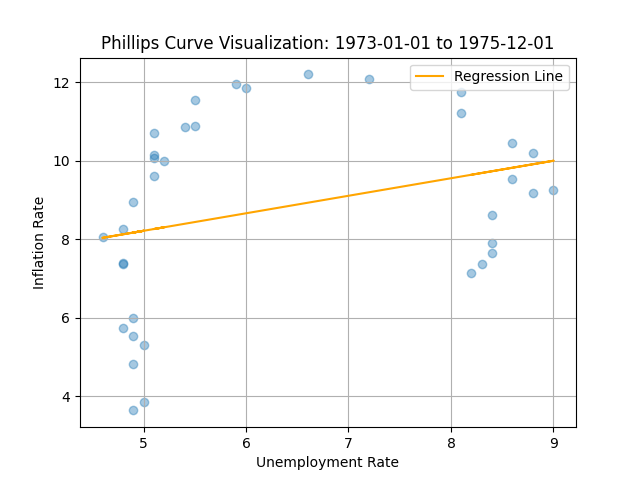
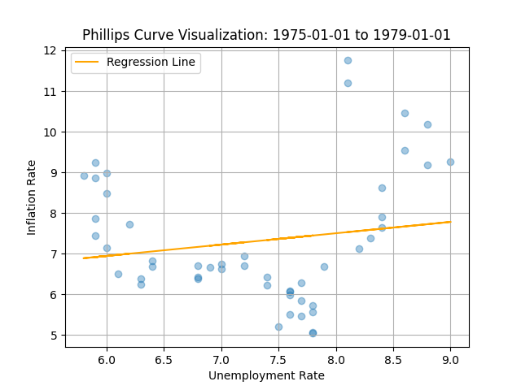
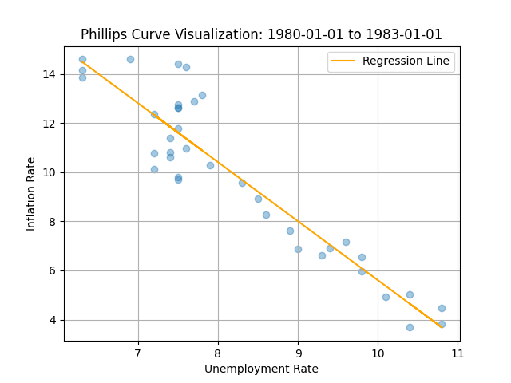
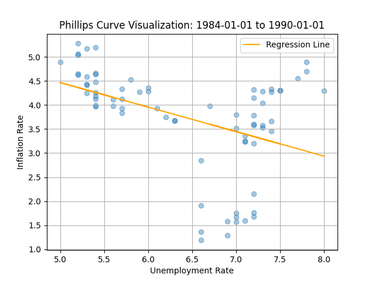
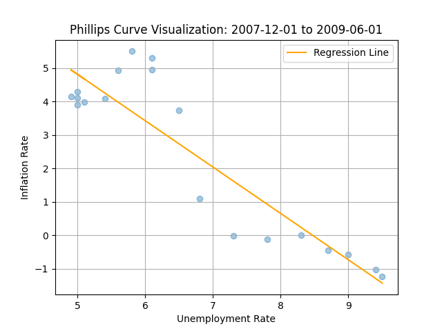
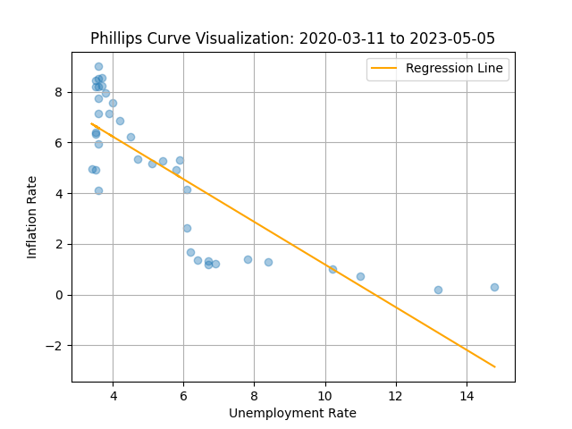
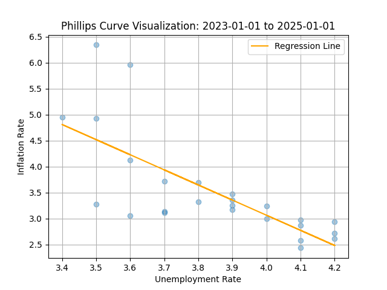
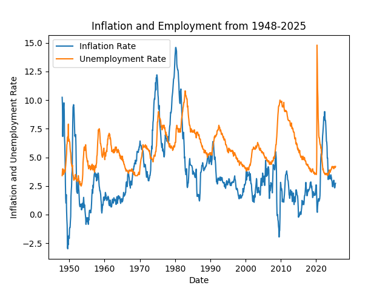

# Phillips-Curve-Data-Visualization
The Phillips Curve is an economic model that predicts an inverse relationship between unemployment and inflation in the short run. That is to say, if unemployment decreases, then inflation increases and vice versa. This project uses unemployment and inflation data from 1948 to 2025 to plot both the inflation rate and unemployment rate from that time period and plots the Phillips Curve during periods of economic significance. 

## Datasets

[U.S. Unemployment Rate (UNRATE) - FRED](https://fred.stlouisfed.org/series/UNRATE)
[Consumer Price Index for All Urban Consumers: All Items in U.S. City Average (CPIAUCSL) - FRED]([https://fred.stlouisfed.org/series/UNRATE](https://fred.stlouisfed.org/series/CPIAUCSL))

## Phillips Curve during postwar recovery (1948-1953)

Phillips Curve holds true and shows a negative slope

## Phillips Curve during 1970s oli shock (1973-1975)

Phillips Curve breaks down as inflation and employment rise together

## Phillips Curve during late 1970s (1975-1979)

Phillips Curve continues to break down with a positive slope

## Phillips Curve during early 1980s (1980-1983)

## Phillips Curve during late 1980s (1985-1990)

## Phillips Curve during the Great Recession (2007-2009)

## Phillips Curve during the COVID-19 Pandemic (2020-2023)

## Phillips Curve post COVID-19 Pandemic (2023-2025)

## Time Series Graph of unemployment and inflation rate from 1948 to 2025 (2023-2025)

